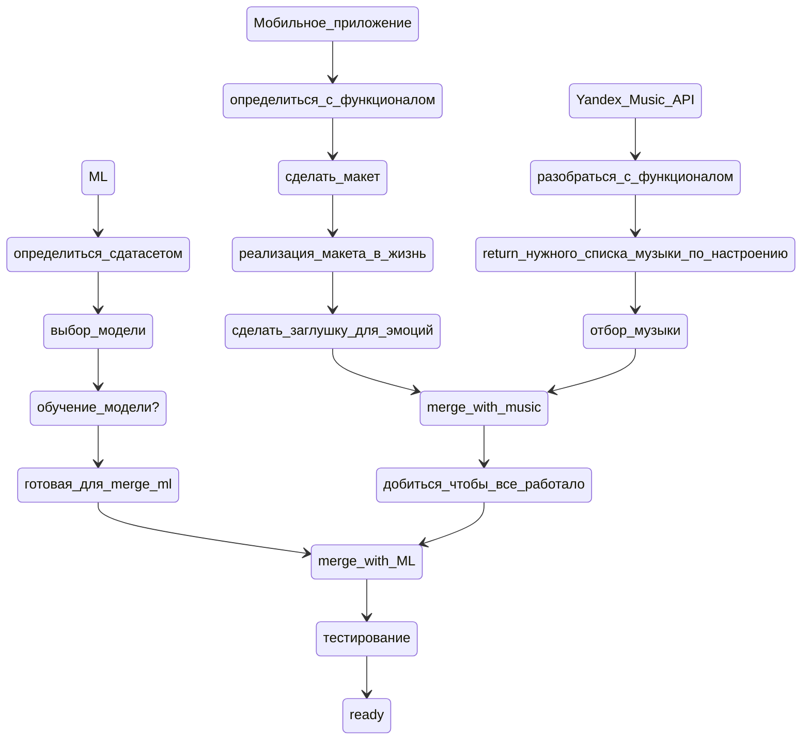

```mermaid
stateDiagram-v2

ML --> определиться_сдатасетом 
определиться_сдатасетом --> выбор_модели
выбор_модели --> обучение_модели?
обучение_модели? --> готовая_для_merge_ml
готовая_для_merge_ml --> merge_with_ML

Мобильное_приложение --> определиться_с_функционалом
определиться_с_функционалом --> сделать_макет
сделать_макет --> реализация_макета_в_жизнь
реализация_макета_в_жизнь --> сделать_заглушку_для_эмоций
сделать_заглушку_для_эмоций --> merge_with_music


Yandex_Music_API --> разобраться_с_функционалом
разобраться_с_функционалом --> return_нужного_списка_музыки_по_настроению
return_нужного_списка_музыки_по_настроению --> отбор_музыки 
отбор_музыки --> merge_with_music


merge_with_music --> добиться_чтобы_все_работало
добиться_чтобы_все_работало --> merge_with_ML
merge_with_ML --> тестирование

тестирование --> ready
```